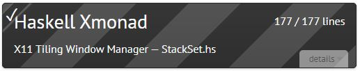
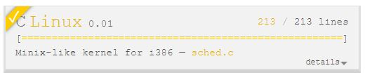
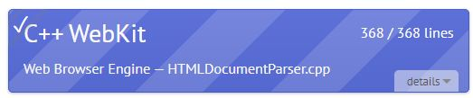
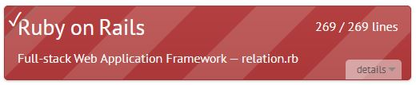
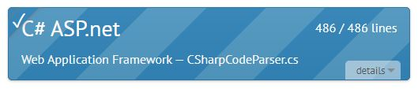
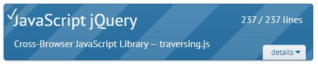

## 401 Pre-Work & Learning Journal
_A spot to drop progress on 401 pre-work assignments as well as other preparatory self-study records (and randos)_

<ins>Self-Study</ins>

- **Bash Practice -Basic Navigation**

- **Bash Practice -More About Files**

- **Bash Practice -Manual Pages**

- **Bash Practice -File Manipulation**

**7/14/2022 - 7/18/2022**

- [Typing Practice - Haskell Xmonad session 1 -DONE](Images/07182022_Typing_Practice_HaskellXmodad_session_1.jpg)

- [Typing Practice - Haskell Xmonad session 2 -DONE](Images/07182022_Typing_Practice_HaskellXmodad_session_2.jpg)

- [Typing Practice - Haskell Xmonad session 3 -DONE](Images/07182022_Typing_Practice_HaskellXmodad_session_3.jpg)

- [Typing Practice - Haskell Xmonad session 4 -DONE](Images/07182022_Typing_Practice_HaskellXmodad_session_4.jpg)

- [Typing Practice - Haskell Xmonad session 5 -DONE](Images/07182022_Typing_Practice_HaskellXmodad_session_5.jpg)

- [Typing Practice - Haskell Xmonad session 6 -DONE](Images/07182022_Typing_Practice_HaskellXmodad_session_6.jpg)

- [Typing Practice - Haskell Xmonad session 7 -DONE](Images/07182022_Typing_Practice_HaskellXmodad_session_7.jpg)

- [Typing Practice - Haskell Xmonad session 8 -DONE](Images/07182022_Typing_Practice_HaskellXmodad_session_8.jpg)

- [Typing Practice - Haskell Xmonad session 9 -DONE](Images/07182022_Typing_Practice_HaskellXmodad_session_9.jpg)

- [Typing Practice - Linux session 1 -DONE](Images/07172022_Typing_Practice_Linux_session_1.jpg)

- [Typing Practice - Linux session 2 -DONE](Images/07172022_Typing_Practice_Linux_session_2.jpg)

- [Typing Practice - Linux session 3 -DONE](Images/07172022_Typing_Practice_Linux_session_3.jpg)

- [Typing Practice - Linux session 4 -DONE](Images/07172022_Typing_Practice_Linux_session_4.jpg)

- [Typing Practice - Linux session 5 -DONE](Images/07172022_Typing_Practice_Linux_session_5.jpg)

- [Typing Practice - Linux session 6 -DONE](Images/07172022_Typing_Practice_Linux_session_6.jpg)

- [Typing Practice - Linux session 7 -DONE](Images/07172022_Typing_Practice_Linux_session_7.jpg)

- [Typing Practice - C++ session 1 -DONE](Images/07142022_Typing_Practice_C++_session_1.jpg)

- [Typing Practice - C++ session 2 -DONE](Images/07142022_Typing_Practice_C++_session_2.jpg)

- [Typing Practice - C++ session 3 -DONE](Images/07152022_Typing_Practice_C++_session_3.jpg)

- [Typing Practice - C++ session 4 -DONE](Images/07152022_Typing_Practice_C++_session_4.jpg)

- [Typing Practice - C++ session 5 -DONE](Images/07172022_Typing_Practice_C++_session_5.jpg)

- [Typing Practice - C++ session 6 -DONE](Images/07172022_Typing_Practice_C++_session_6.jpg)

- [Typing Practice - C++ session 7 -DONE](Images/07172022_Typing_Practice_C++_session_7.jpg)

- [Typing Practice - C++ session 8 -DONE](Images/07172022_Typing_Practice_C++_session_8.jpg)

- [Typing Practice - C++ session 9 -DONE](Images/07172022_Typing_Practice_C++_session_9.jpg)

- [Typing Practice - C++ session 10 -DONE](Images/07172022_Typing_Practice_C++_session_10.jpg)

- [Typing Practice - C++ session 11 -DONE](Images/07172022_Typing_Practice_C++_session_11.jpg)

- [Typing Practice - C++ session 12 -DONE](Images/07172022_Typing_Practice_C++_session_12.jpg)

- [Typing Practice - C++ session 13 -DONE](Images/07172022_Typing_Practice_C++_session_13.jpg)

- [Typing Practice - C++ session 14 -DONE](Images/07172022_Typing_Practice_C++_session_14.jpg)

- [Typing Practice - C++ session 15 -DONE](Images/07172022_Typing_Practice_C++_session_15.jpg)

- [Typing Practice - C++ session 16 -DONE](Images/07172022_Typing_Practice_C++_session_16.jpg)

--- 

**7/11/2022**  
_I am rested today. Too much to do on all fronts, but rested enough to face it with a degree of confidence._

<ins>401Pre-Work</ins>

- [Git Practice - Part 4 of 5 -A Mixed Bag](Images/GitPractice_A_Mixed_Bag.jpg)

- [Typing Practice - Ruby session 1 -DONE](Images/07112022_Typing_Practice_Ruby_session_1.jpg)

- [Typing Practice - Ruby session 2 -DONE](Images/07112022_Typing_Practice_Ruby_session_2.jpg)

- [Typing Practice - Ruby session 3 -DONE](Images/07112022_Typing_Practice_Ruby_session_3.jpg)

- [Typing Practice - Ruby session 4 -DONE](Images/07112022_Typing_Practice_Ruby_session_4.jpg)

- [Typing Practice - Ruby session 5 -DONE](Images/07112022_Typing_Practice_Ruby_session_5.jpg)

- [Typing Practice - Ruby session 6 -DONE](Images/07112022_Typing_Practice_Ruby_session_6.jpg)

- [Typing Practice - Ruby session 7 -DONE](Images/07112022_Typing_Practice_Ruby_session_7.jpg)

- [Typing Practice - Ruby session 8 -DONE](Images/07112022_Typing_Practice_Ruby_session_8.jpg)

- [Typing Practice - Ruby session 9 -DONE](Images/07112022_Typing_Practice_Ruby_session_9.jpg)

- [Typing Practice - Ruby session 10 -DONE](Images/07112022_Typing_Practice_Ruby_session_10.jpg)

- [Typing Practice - Ruby session 11 -DONE](Images/07112022_Typing_Practice_Ruby_session_11.jpg)

- [Typing Practice - Ruby session 12 -DONE](Images/07112022_Typing_Practice_Ruby_session_12.jpg)

- [Typing Practice - Ruby session 13 -DONE](Images/07112022_Typing_Practice_Ruby_session_13.jpg)

---

**7/10/2022**  
_I am well rested today._

<ins>401Pre-Work</ins>

Career Coaching Assignment: Professional Competencies -DONE

---

**7/5/2022 -Day 5:**  
_I slept so much! It was awesome!! Today's outlook is quite positive!_

<ins>401Pre-Work</ins>

- **Bash Practice -The Command Line**

&nbsp;&nbsp;&nbsp;&nbsp;&nbsp;&nbsp; _"If you are on Windows and intend to remotely log into another machine then you will need an SSH client. A rather good one is [Putty](http://www.chiark.greenend.org.uk/~sgtatham/putty/download.html)"_

---

**7/4/2022 -Day 4:**  
_Happy 4th of July! Sleep was broken a LOT last night (Thanks Bob!) I am dehydrated (and really not wanting water) and can barely hold my eyes open!_

<ins>401Pre-Work</ins>

- [Git Practice - Part 3 of 5 -Moving Work Around -DONE](Images/GitPractice_Moving_Work_Around.jpg)

---

**7/3/2022 -Day 3:**  
_My sister braided my hair last night into the wee-early hours of the morning. I got home at 5:00 A.M. so of course I'm exhausted again... but my hair is purple so Yay!_

<ins>401Pre-Work</ins>

- [Git Practice - Part 2 of 5 -Ramping Up DONE-](Images/GitPractice_Ramping_Up.jpg)

- [Typing Practice - Git Shell session 1 -DONE](Images/07032022_Typing_Practice_GitShell_session_1.jpg)

- [Typing Practice - Git Shell session 2 -DONE](Images/07032022_Typing_Practice_GitShell_session_2.jpg)

- [Typing Practice - Git Shell session 3 -DONE](Images/07032022_Typing_Practice_GitShell_session_3.jpg)

- [Typing Practice - Git Shell session 4 -DONE](Images/07032022_Typing_Practice_GitShell_session_4.jpg)

- [Typing Practice - Git Shell session 5 -DONE](Images/07032022_Typing_Practice_GitShell_session_5.jpg)

- [Typing Practice - Git Shell session 6 -DONE](Images/07032022_Typing_Practice_GitShell_session_6.jpg)

- [Typing Practice - Git Shell session 7 -DONE](Images/07032022_Typing_Practice_GitShell_session_7.jpg)

- [Typing Practice - Git Shell session 8 -DONE](Images/07032022_Typing_Practice_GitShell_session_8.jpg)

- [Typing Practice - Git Shell session 9 -DONE](Images/07032022_Typing_Practice_GitShell_session_9.jpg)

- [Typing Practice - Git Shell session 10 -DONE](Images/07032022_Typing_Practice_GitShell_session_10.jpg)

- [Typing Practice - Git Shell session 11 -DONE](Images/07032022_Typing_Practice_GitShell_session_11.jpg)

- [Typing Practice - Git Shell session 12 -DONE](Images/07032022_Typing_Practice_GitShell_session_12.jpg)

- [Typing Practice - Git Shell session 13 -DONE](Images/07032022_Typing_Practice_GitShell_session_13.jpg)

- [Typing Practice - Git Shell session 14 -DONE](Images/07032022_Typing_Practice_GitShell_session_14.jpg)

- [Typing Practice - Git Shell session 15 -DONE](Images/07032022_Typing_Practice_GitShell_session_15.jpg)

---

**7/2/2022 -Day 2:**  
_Crazy dog Bob let me sleep a bit more last night so I'm tired, but not bone-weary exhausted, YAY!_

<ins>Self-Study</ins>
- [What is ASP.NET? (Video)](https://www.youtube.com/watch?v=fkdMdZmdBs4)

&nbsp;&nbsp;&nbsp;&nbsp;&nbsp;&nbsp; _Notes_

- _ASP.NET is a server-side web app technology created by MS & released in 2002; Twitter, Instagram, and FB run on ASP.NET;_
- _IIS (Inteli Information Services) is a web-server used to host ASP.NET web apps_
-  _Workflow: ASP.NET requests an HTML fle from server, IIS passes that info to ASP.NET engine which reads and executes the code, then the ASP.NET engine returns it to the browser as an html file_
- _3 components upon which asp.net relies: language (i.e. C#); library (i.e. "web libary"); and common language run-time (platform used to execute the programs -no example given)_
- _Tools: MS Web platform installer, SQL Complete, Web Essentials for VS, ReSharper_

<ins>401Pre-Work</ins>

- [Typing Practice - C# session 1 -DONE](Images/07022022_Typing_Practice_CSharp_session_1.jpg)

- [Typing Practice - C# session 2 -DONE](Images/07022022_Typing_Practice_CSharp_session_2.jpg)

- [Typing Practice - C# session 3 -DONE](Images/07022022_Typing_Practice_CSharp_session_3.jpg)

- [Typing Practice - C# session 4 -DONE](Images/07022022_Typing_Practice_CSharp_session_4.jpg)

- [Typing Practice - C# session 5 -DONE](Images/07022022_Typing_Practice_CSharp_session_5.jpg)

- [Typing Practice - C# session 6 -DONE](Images/07022022_Typing_Practice_CSharp_session_6.jpg)

- [Typing Practice - C# session 7 -DONE](Images/07022022_Typing_Practice_CSharp_session_7.jpg)

- [Typing Practice - C# session 8 -DONE](Images/07022022_Typing_Practice_CSharp_session_8.jpg)

- [Typing Practice - C# session 9 -DONE](Images/07022022_Typing_Practice_CSharp_session_9.jpg)

- [Typing Practice - C# session 10 -DONE](Images/07022022_Typing_Practice_CSharp_session_10.jpg)

- [Typing Practice - C# session 11 -DONE](Images/07022022_Typing_Practice_CSharp_session_11.jpg)

- [Typing Practice - C# session 12 -DONE](Images/07022022_Typing_Practice_CSharp_session_12.jpg)

- [Typing Practice - C# session 13 -DONE](Images/07022022_Typing_Practice_CSharp_session_13.jpg)

- [Typing Practice - C# session 14 -DONE](Images/07022022_Typing_Practice_CSharp_session_14.jpg)

- [Typing Practice - C# session 15 -DONE](Images/07022022_Typing_Practice_CSharp_session_15.jpg)

- [Typing Practice - C# session 16 -DONE](Images/07022022_Typing_Practice_CSharp_session_16.jpg)

- [Typing Practice - C# session 17 -DONE](Images/07022022_Typing_Practice_CSharp_session_17.jpg)

- [Typing Practice - C# session 18 -DONE](Images/07022022_Typing_Practice_CSharp_session_18.jpg)

- [Typing Practice - C# session 19 -DONE](Images/07022022_Typing_Practice_CSharp_session_19.jpg)

- [Typing Practice - C# session 20 -DONE](Images/07022022_Typing_Practice_CSharp_session_20.jpg)

- [Typing Practice - C# session 21 -DONE](Images/07022022_Typing_Practice_CSharp_session_21.jpg)

- [Git Practice - Part 1 of 5 -Introduction Sequence -DONE](Images/GitPractice_Introduction_Sequence.jpg)

---

**7/1/2022 -Day 1:** 
_I am exhausted (Crazy dog Bob kept me up all night) but still in a pretty good headspace today. I am TOTALLY looking forward to 401 starting on Dec 3!_

<ins>401Pre-Work</ins>

- [Typing Practice - jQuery session 1 -DONE](Images/07012022_Typing_Practice_jQuery_session_1.jpg)
- [Typing Practice - jQuery session 2 -DONE](Images/07012022_Typing_Practice_jQuery_session_2.jpg)
- [Typing Practice - jQuery session 3 -DONE](Images/07012022_Typing_Practice_jQuery_session_3.jpg)
- [Typing Practice - jQuery session 4 -DONE](Images/07012022_Typing_Practice_jQuery_session_4.jpg)
- [Typing Practice - jQuery session 5 -DONE](Images/07012022_Typing_Practice_jQuery_session_5.jpg)
- [Typing Practice - jQuery session 6 -DONE](Images/07012022_Typing_Practice_jQuery_session_6.jpg)
- [Typing Practice - jQuery session 7 -DONE](Images/07012022_Typing_Practice_jQuery_session_7.jpg)
- [Typing Practice - jQuery session 8 -DONE](Images/07012022_Typing_Practice_jQuery_session_8.jpg)
- [Typing Practice - jQuery session 9 -DONE](Images/07012022_Typing_Practice_jQuery_session_9.jpg)
- [Typing Practice - jQuery session 10 -DONE](Images/07012022_Typing_Practice_jQuery_session_10.jpg)
- [Typing Practice - jQuery session 11 -DONE](Images/07012022_Typing_Practice_jQuery_session_11.jpg)

- [Reading 1 of 5 - Act like you make $1000/hr -DONE](https://anthony-moore.medium.com/pretend-your-time-is-worth-1-000-hour-and-youll-become-100x-more-productive-6ab2302b8e8c)

- [Reading 2 of 5 - How to think like a programmer -DONE](https://medium.freecodecamp.org/how-to-think-like-a-programmer-lessons-in-problem-solving-d1d8bf1de7d2)

- [Reading 3 of 5 - Solving Problems -DONE](https://simpleprogrammer.com/solving-problems-breaking-it-down/)

- [Reading 4 of 5 - The 5 Whys -DONE](https://www.mindtools.com/pages/article/newTMC_5W.htm) 

- [Reading 5 of 5 - The Super Mario Effect (video) -DONE](https://www.youtube.com/watch?v=9vJRopau0g0)

**Discussion Question 1: What’s the one thing I bring to this career (and a potential employer) that nobody else can?**

_To the field of Star Trek VR Curatorship, I bring the right mix of ingredients! There are tons of Star Trek fans out there, there are plenty of coders that are a few VR afficionados, there is an over-abundance of people who can successfully work remotely. I however am the tri-fecta: a fan of every flavor of Star Trek (yes even that one with the unfortunate into music) who codes for joy not just for money, who hasn't grown tired of VR and who has a proven track record for effectively contributing from a home office for many years._

**Discussion Question 2: What are 3 things I’ll start doing to “un-stick” myself whenever I get stuck on tough piece of code, logic, or feature?**

_Three things I'll start doing to un-stick myself will be:_
- _Explain the goal and the blocker in as much detail as possible to one of my dogs. If they have no suggestions perhaps I'll then take the matter to a co-worker or classmate._ 
- _Afford some time to consider and examine corner or edge cases and not limit my problem solving to only a limited main case solution._ 
- _If stuck implementing a solution, I'll try writing it out completely in comments or pseudo-code and only after the pseudo solution is sound, go back and convert it into syntactic code._
